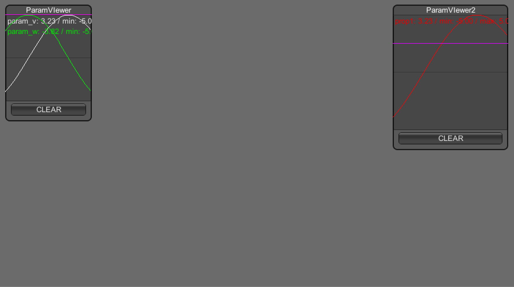

# ParamViewer

~~~cs
float v = 0;

void Start () {
	GraphParam graph = new GraphParam("param_v");
	graph.maxY = 5.0f;
	graph.color = Color.blue;
	graph.drawType = GraphParam.DrawType.Line;
	pramView.SetGraphParam(graph);
}

void Update () {
	pramView.AddData("param_v", v);
}
~~~

~~~cs
float v = 0;

public GraphParam graph;

void Start () {
	pramView.SetGraphParam(graph);
}
void Update () {
	graph.AddData (v);
}
~~~
